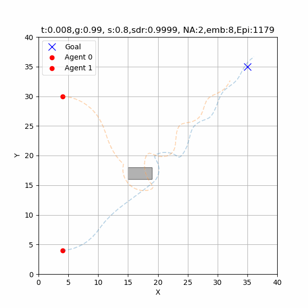

# ddpg-marl-boxpushing-attn
Multi-agent box-pushing using DDPG with attention-based critic and actor architectures.

### Multi-Agent Reinforcement Learning with Attention-based Centralized Critic

## 🚀 Overview
In this work, we investigate the role of attention within a centralized critic in a cooperative continuous-space task involving both coordination and physical interaction.
A detailed 2D two-phase box-pushing environment is developed using second-order unicycle agents, torque-based dynamics, and a two-phase cooperative objective.
Within the Deep Deterministic Policy Learning framework, we compare three actor–critic systems: a standard baseline critic, an extended critic with additional environmental information, and an attention critic.
All setups employ the same actor trained to handle both task phases.
Results show that only the attention-based critic achieves reliable convergence and efficient phase transitions, demonstrating that attention is structurally required when a single critic must represent multiple task contexts.
The system uses:
- **Runge-Kutta 4th Order (RK4)** dynamics
- **Friction & inertia modeling**
- **Attention-based centralized critic** for cooperative learning
---
## ⚙️ Environment Dynamics
Each agent is modeled as a unicycle robot with two continuous control outputs: a forward force and a steering angle. These controls respect non-holonomic constraints, requiring agents to rotate gradually to reorient. Figure below is an illustration of the game indicating the agents $r_i, i=1,2$ moving in the direction of their velocities $v_i$, taking the input force  $f_i\$ with the steering angle $alpha_i$ to push the box $b$ toward the goal $G$. 

| Entity | Variables | Description |
|--------|------------|--------------|
| Agent | ($x, y, θ, F, ω$) | Position, orientation, and action |
| Box | (x_b, y_b, θ_b) | Center position and rotation |
| Goal | (X_G, Y_G ) | Position of the Goal |

- Both agents and box motion are integrated using **RK4**.
- Once an agent reaches the box, it “sticks” and starts pushing.
- Rewards are **staged**:
  - **Phase 1:** Reach the box (terminal reward)
  - **Phase 2:** Push box toward goal (instantaneous reward)

---
## 📈 Results

| Framework | Convergence (Episodes) | Smoothness | Robustness |
|------------|------------------------|-------------|-------------|
| Baseline Critic | ~3700 | ⚪⚪⚪⚫⚫ | ⚪⚪⚪⚫⚫ |
| Extended Baseline Critic | ~6700 | ⚪⚪⚪⚪⚪ | ⚪⚪⚫⚫⚫ |
| Attention-Based Critic | ~1200 | ⚪⚪⚪⚪⚪ | ⚪⚪⚪⚪⚫ |

---
